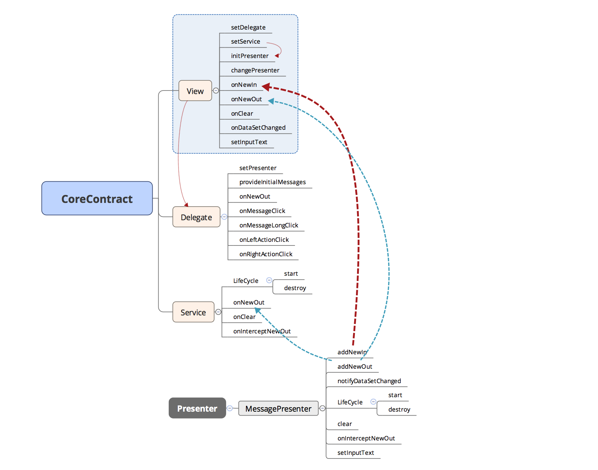

# TimeMachine
时空稳定装置


It's a SDK that looks like IM, but it's not IM.

It is still in its infancy. Change frequently.

Service sample, built with google/Agera:
`/transformer`


SDK:
`/timemachine`



#### Goals
- One-way APIs.

#### Build

```bash
./repo.sh
./gradlew
```


